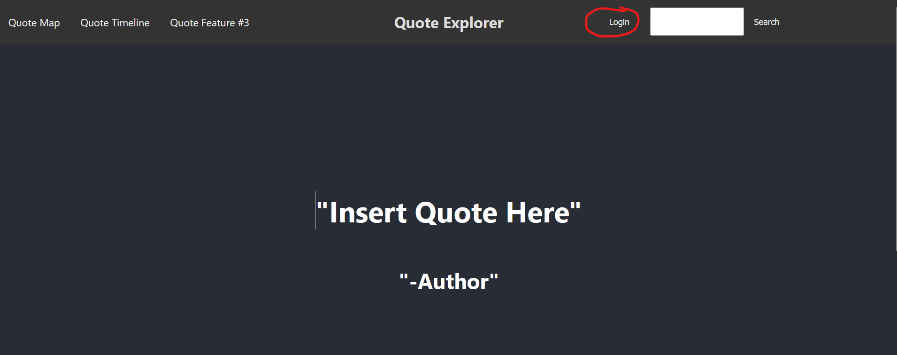
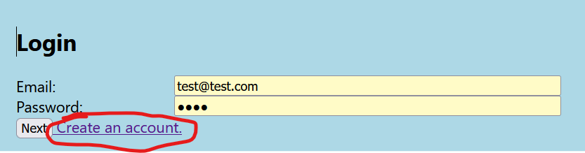
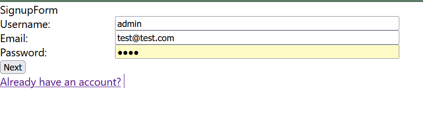

# cs348-quoteproject
The platform we are using to host our database is postgresql

## Generating the production dataset
Data quote.json downloaded from:
https://www.kaggle.com/datasets/akmittal/quotes-dataset

Run the script from Data Preprocessing called quotetable.py to turn the quote.json into an insertable sql file
Run The getauthorsfromwikidata.ipynb to download the authors table info from the wikidata database
Run the authortable.py file to turn the downloaded authors json into an insertable sql file

## Database Setup
To load the database into postgresql, simply: 
  1. install the latest version of postgres and open pgadmin 4
  2. inside of pgadmin4, create a new database 
  3. using the query tool, load the database.sql files inside ~/backend/table-queries/sample/ and run it
    - insert the authorstable.sql file first
    - insert the user_infotable.sql file second
    - insert the quotestable.sql file last
  4. then refresh the database and all the tables should now be present
  5. you can then the query tool again to do sql querys

## Virtual Environment Setup
Make sure you are in the backend directory:

To set up virtual environment on windows:  
  6. Create a virtual environment using the requirements.txt. This can be done by "conda create --name <env> --file requirements.txt".  
  7. Activate your virtual environment.  
  8. Go to the directory ./cs348-quoteproject in cmd and run "flask run" to start the flask backend. Then proceed to frontend setup.   

To set up virtual env on mac:  
  Create virtual env:  
    6. `python -m venv venv`  
  Start virtual env:  
    7. source venv/bin/activate  
  Install dependencies  
    8. `pip install -r requirements.txt`  
  Start backend server:  
    9. `flask run`  

## Frontend Setup

`cd frontend`

Install Dependencies:

`npm i`

Run in development mode:

`npm start`

This should take you to the front page.
## Logging into Quote Explorer

You can navigate to the login page by clicking on the login button at the top right.



You can use the following credentials to login:

```
email: test@test.com
password: test
```
Or you can enter your own credentials by first creating an account.

### Creating an account

From the login page, click on "Create an account". 



Enter your information and click Next. 



You can now login using with your new account.
